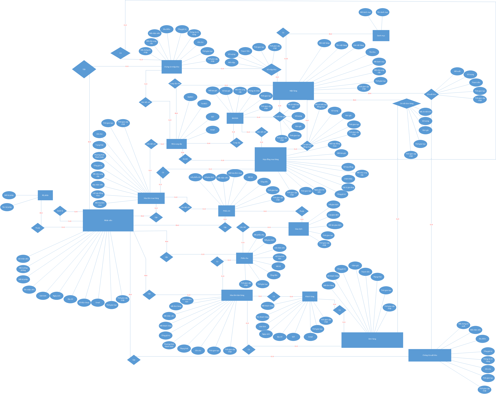
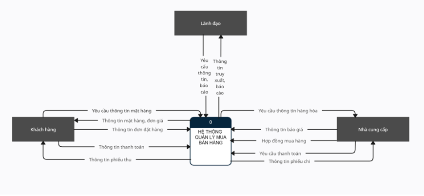
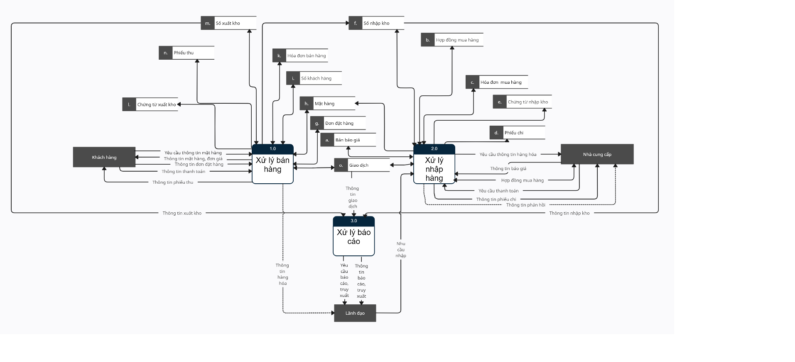
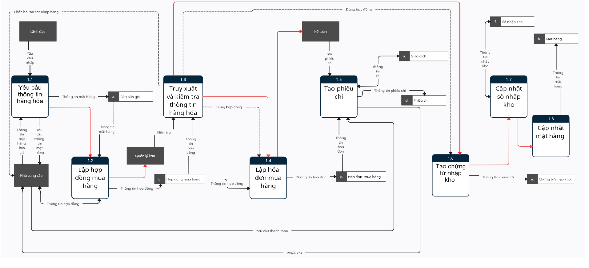
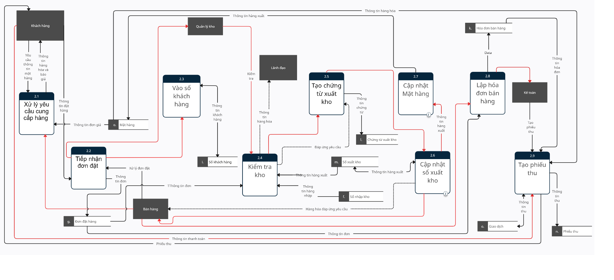
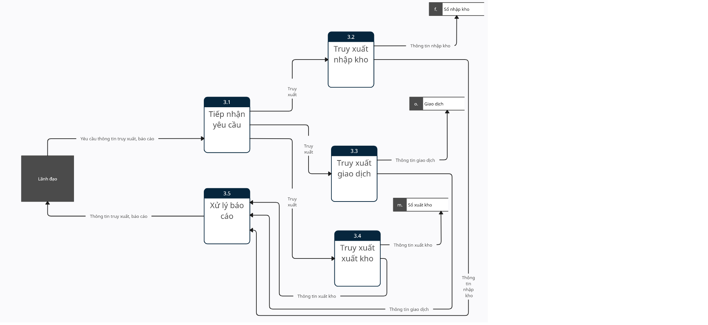
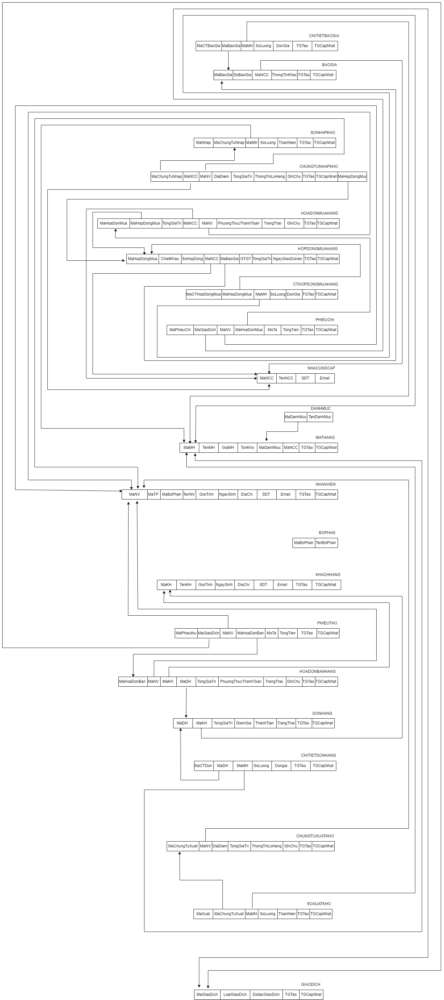
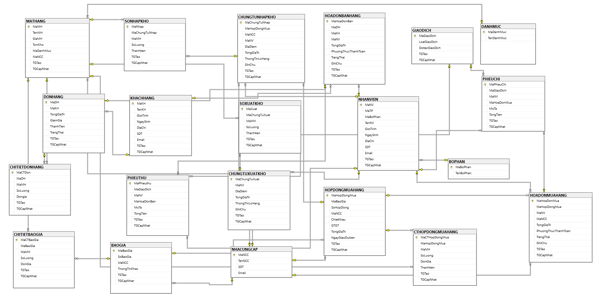
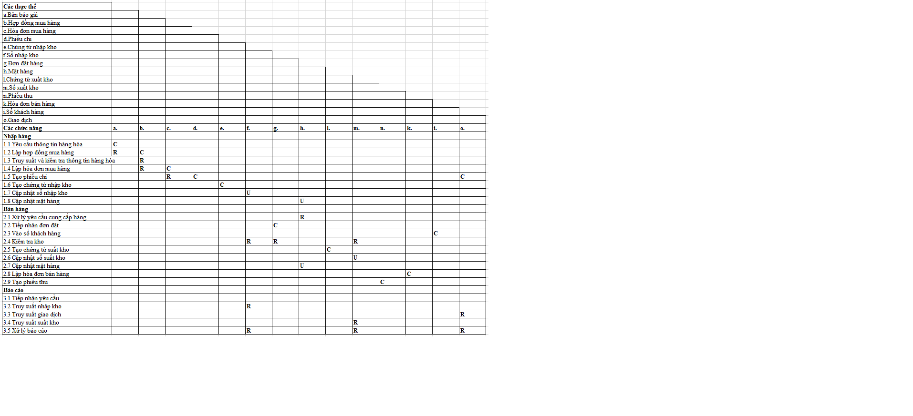

# [POWER BI] HR Analytics 
## I. Introduction
### 1. Introduction to job requirements
- Anh Phong flower shop is a newly established business. Goods The store's main business includes: silk flowers, ornamental plants and serving items interior decoration and entertainment needs. As a newly established business, it should operate It is still mainly manual, relying on the experience of the system staff. Because of the density The volume of imported and exported goods is increasingly large, so management and trading are very difficult A lot of time and effort without high accuracy, this often causes damage for company. Today the store is gradually modernizing its computer system and put the software system into use to gradually replace manual management in company.

## II. Design 
**Here are the five model of design thinking:**
### Model 1 - ERD
 

### Model 2 - Level 0

### Model 3 - Level 1

### Model 4 - Level 2 - Sales

### Model 5 - Level 2 - import goods

### Model 6 - Level 2 - Reports

### Model 7 - RDM

### Model 7 - ER

### Model 8 - Matrix ER

